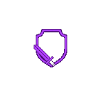

# ⚔️ Simulateur-de-Combat | Beyond the Curse v1.0
## Application de Bureau Standalone

> Simulateur de combat autonome pour comparer et analyser les effets de fruits du démon, classes, races et items dans un environnement RPG. Désormais disponible en version native desktop avec Electron.js !

<!-- SVG animation pour style dynamique -->
<p align="center">
  
</p>

<div align="center">

  
  
  
  

</div>

---

## 🚀 **Nouveautés de la Version Standalone**

### ⚡ **Totalement Autonome**
- **Plus besoin de Tailscale** ou de connexion réseau
- **Ajout de DiscordRPC** pour l'intégration Discord
- Application **100% offline** avec toutes les données locales

### 🖥️ **Application Native Desktop**
- Interface optimisée pour le bureau avec **Electron.js**
- **Performance améliorée** par rapport à la version web
- **Fenêtre redimensionnable** et expérience utilisateur native
- Toutes vos données restent **100% locales** sur votre machine

---

## 📦 **Installation & Utilisation**

### 🔽 **Téléchargement**
1. **Téléchargez** l'une des versions disponibles :
   - `btc-calc.Setup.exe` - Version avec installateur
   - `btc-calc.portable.exe` - Version portable (sans installation)

2. **Lancez** l'application directement
3. **Profitez** de votre simulateur de combat personnel !

> ⚠️ **Note de Sécurité** : Windows peut afficher un avertissement lors du premier lancement. Cliquez sur "Plus d'informations" puis "Exécuter quand même" pour continuer.

### 📋 **Configuration Requise**
| Composant | Détail |
|-----------|--------|
| **Moteur** | Electron.js + Chromium |
| **Taille** | ~150 MB (tout inclus) |
| **OS Supporté** | Windows 10/11 (64-bit) |
| **RAM Requise** | 4 GB minimum |

---

## 🎮 **Fonctionnalités Complètes**

### ✅ **Simulateur de Combat Avancé**
- Comparaison des fruits du démon, races, classes et items
- Calculs précis de dégâts, réduction et temps de kill (TTK)
- Système de combat avec heal/min et dégâts nets
- Algorithme de combat avec réduction de 60% des dégâts

### ✅ **Base de Données Locale Intégrée**
- Toutes les données stockées sur votre PC
- Historique des combats sauvegardé automatiquement
- Aucune perte de données même hors ligne
- Sauvegarde dans localStorage du navigateur intégré

### ✅ **Interface Utilisateur Intuitive**
- Design Bootstrap 5 responsive
- Navigation par onglets dynamiques
- Affichage en temps réel des statistiques
- Optimisée pour l'usage desktop

---

<details>
<summary>📁 <strong>Architecture Technique</strong></summary>

### Structure de l'Application
```bash
app/
  ├── assets/
  │   ├── audio/           # Sons intégrés
  │   ├── css/             # style.css avec Bootstrap 5
  │   ├── img/             # Logos et illustrations
  │   └── js/              # stats.js - logique principale
  ├── index.html           # Interface utilisateur principale
  ├── main.js              # Process principal Electron
  └── package.json         # Configuration Electron
```

### Logique de Combat
| Élément | Calcul | Description |
|---------|--------|-------------|
| **Dégâts/min** | Classe + Race + Fruit | Dégâts totaux par minute |
| **Réduction** | 60% efficacité | Facteur de réduction des dégâts |
| **Heal/min** | Récupération | Soins par minute |
| **TTK** | PV ÷ Dégâts nets | Temps pour éliminer l'adversaire |
| **Vainqueur** | TTK le plus bas | Détermine le gagnant du combat |

</details>

---

## 📝 **Notes de Version**

### **v1.0 - Release Initiale Standalone**
- ✨ Première version autonome avec Electron.js
- 🔧 Migration complète de la version web Tailscale
- 🎯 Optimisations de performance pour l'usage desktop
- 📱 Interface adaptée pour les applications de bureau
- 🔒 Données 100% locales et sécurisées
- 🎮 Intégration DiscordRPC pour l'affichage d'activité

---

## 🆘 **Support & Feedback**

Rencontrez-vous des problèmes ou avez-vous des suggestions ?

- 🐛 **Bugs** : Signalez les problèmes techniques rencontrés
- 💡 **Suggestions** : Proposez de nouvelles fonctionnalités
- ⭐ **Avis** : Votre retour nous aide à améliorer l'application
- 🔧 **Performance** : Partagez vos retours sur l'expérience utilisateur

---

## 👨‍💻 **Équipe de Développement**

- **Dirigé par** : `insupp0rtable`
- **Conçu par** : `_ImDarling_`
- **Version Electron** : Optimisée pour l'usage standalone

---

## 🔄 **Évolution du Projet**

**Ancienne Version** → **Version Actuelle**
- ~~Nécessitait Tailscale~~ → **100% Autonome**
- ~~Accès réseau requis~~ → **Totalement Offline**
- ~~Interface web~~ → **Application native desktop**
- ~~Dépendance serveur~~ → **Données locales**

<!-- SVG animation pour style dynamique -->
<p align="center">
  
</p>

---

*Simulateur de Combat | Beyond the Curse - Version Standalone v1.0*